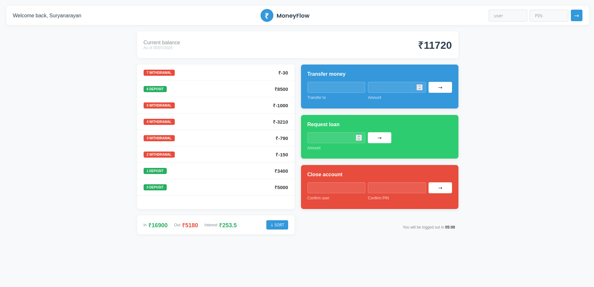

# 💸 MoneyFlow - Mini Bank Web App

A sleek, responsive, and interactive JavaScript-based mini bank application that mimics basic banking operations like login, fund transfers, loan requests, and account closure.

## 🚀 Live Demo
👉 [Try it out here](https://moneyflow-app.vercel.app/)

# LOGIN Credentials (username - password) :---
1. ps - 1111
2. sa - 2222
3. ks - 3333
4. ap - 4444

## 📸 Preview
 <!-- optional, if you add a preview -->

## 🧰 Built With
- HTML5
- CSS3
- Vanilla JavaScript

## 🧠 Features
- Login authentication (username + PIN)
- Transfer funds between users
- Request loans
- Account closure
- Dynamic transaction display
- Responsive design
- Logout countdown timer
